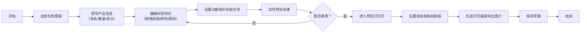

## 1. 产品概述

手工皂标签设计工具，为手工皂小店提供一站式产品标签和配方说明卡设计解决方案。用户可选择模板、录入配方、拖拽排版、实时预览，最终生成可打印的标签或导出图片。

- **核心目标**：降低手工皂店主的设计门槛，快速制作专业美观的产品标签
- **目标用户**：手工皂小店店主、DIY手工皂爱好者、小型护肤品工作室
- **产品价值**：无需专业设计技能，几分钟即可生成符合品牌调性的产品标签

## 2. 核心 Features

### 2.1 Feature Modules

1. **模板选择页**：圆形贴纸模板、方形说明卡模板、多种预设风格
2. **标签编辑页**：配方录入、成分排序、尺寸设置、文字编辑、拖拽排版、图标添加、颜色搭配、过敏提示、批次编号
3. **预览打印页**：多标签排版预览、纸张规格选择、打印排版生成、单张图片导出
4. **草稿管理**：本地存储草稿、自动保存、草稿列表管理

### 2.2 Page Details

| 页面名称 | 模块名称 | Feature Description |
|---------|---------|---------------------|
| 模板选择页 | 模板展示区 | 网格布局展示圆形贴纸、方形说明卡、异形标签等多种模板，支持悬停预览效果 |
| 模板选择页 | 分类筛选 | 按标签类型（圆形/方形/异形）、风格（简约/复古/清新/奢华）筛选模板 |
| 标签编辑页 | 基础信息表单 | 皂名、重量、成分列表、使用方法、保存期限、批次编号输入 |
| 标签编辑页 | 成分管理 | 添加/删除成分、拖拽调整成分顺序、设置过敏原高亮标记 |
| 标签编辑页 | 尺寸设置 | 自定义标签宽高、预设常用尺寸（3cm/5cm/8cm圆形、A6/A7说明卡） |
| 标签编辑页 | 画布编辑器 | 可视化画布、拖拽移动元素、缩放旋转、图层排序、实时预览 |
| 标签编辑页 | 样式面板 | 字体选择、字号调整、颜色搭配、预设配色方案、边框/背景设置 |
| 标签编辑页 | 图标素材库 | 分类图标（植物/精油/工具/装饰）、SVG图标、支持自定义上传 |
| 预览打印页 | 多标签预览 | 同一页面预览多个不同标签、支持翻页查看 |
| 预览打印页 | 排版设置 | 纸张规格（A4/A5/6寸相纸）、标签数量、间距设置、自动排列 |
| 预览打印页 | 导出功能 | 打印预览、PNG/JPG导出、PDF导出（单张/整版） |
| 草稿管理 | 草稿列表 | 显示所有保存的草稿、缩略图预览、编辑/删除操作 |

## 3. Core Process

用户完整流程：选择模板 → 录入配方信息 → 拖拽调整布局和样式 → 预览单张效果 → 批量排版预览 → 打印或导出 → 自动保存草稿。

## 4. User Interface Design

### 4.1 设计风格

- **整体风格**：有机自然风，温暖干净，带有手工质感
- **主色调**：米白色 (#FAF8F5) 作为背景，暖棕色 (#8B7355) 作为主色
- **辅助色**：鼠尾草绿 (#9CAF88)、淡薰衣草紫 (#C9B1D6)、陶土橘 (#D4A574)
- **点缀色**：柔粉色 (#E8C4C4)、浅薄荷绿 (#B8D8D0)
- **按钮样式**：圆角矩形 (border-radius: 12px)、轻微阴影、hover 状态有微妙缩放
- **字体选择**：
  - 标题："Noto Serif SC" 或 "Source Serif Pro"（优雅衬线体，体现手工质感）
  - 正文："Noto Sans SC" 或 "Source Han Sans"（清晰易读的无衬线体）
  - 装饰性字体：可选用 "Ma Shan Zheng" 或手写风格字体用于皂名
- **布局风格**：三栏布局（左侧工具面板、中间画布、右侧属性面板），卡片式组件，柔和阴影
- **图标风格**：线性简约图标，颜色与主色调统一，大小 16-24px
- **质感细节**：细微噪点纹理背景、柔和渐变、纸张质感阴影

### 4.2 页面设计概览

| 页面名称 | 模块名称 | UI Elements |
|---------|---------|-------------|
| 模板选择页 | Hero区域 | 温暖渐变背景、大标题、副标题、行动按钮 |
| 模板选择页 | 模板网格 | 卡片式布局、悬停放大效果、标签角标（圆形/方形） |
| 标签编辑页 | 画布区域 | 仿纸张质感背景、可拖拽元素、选中状态高亮、参考线 |
| 标签编辑页 | 左侧面板 | 折叠式分类、图标列表、搜索框、拖拽手柄 |
| 标签编辑页 | 右侧面板 | Tab切换（属性/样式/设置）、实时颜色预览、滑块控制 |
| 预览打印页 | 打印预览 | 模拟纸张效果、分页指示、裁剪线标记 |
| 预览打印页 | 设置面板 | 下拉选择器、数字输入框、实时预览更新 |
| 全局 | 导航栏 | 面包屑导航、保存按钮、导出按钮、草稿入口 |

### 4.3 响应式设计

- **Desktop-first**：主要针对桌面端优化，画布区域需要较大空间
- **平板适配**：调整面板宽度，可折叠侧边栏
- **触屏优化**：拖拽区域扩大、按钮最小尺寸 44x44px、双指缩放支持
- **打印媒体查询**：专门的打印样式，隐藏所有UI控件，仅保留标签内容

### 4.4 动效设计

- **页面切换**：淡入淡出 + 轻微位移，过渡时长 300ms
- **拖拽交互**：元素抓起时轻微放大 + 阴影加深，释放时有回弹效果
- **按钮hover**：上移 2px + 阴影加深，过渡时长 150ms
- **面板展开/收起**：高度动画 + 透明度变化
- **画布加载**：元素逐个淡入，错落有致的动画延迟
- **保存成功**：右上角滑入提示条，3秒后自动消失
