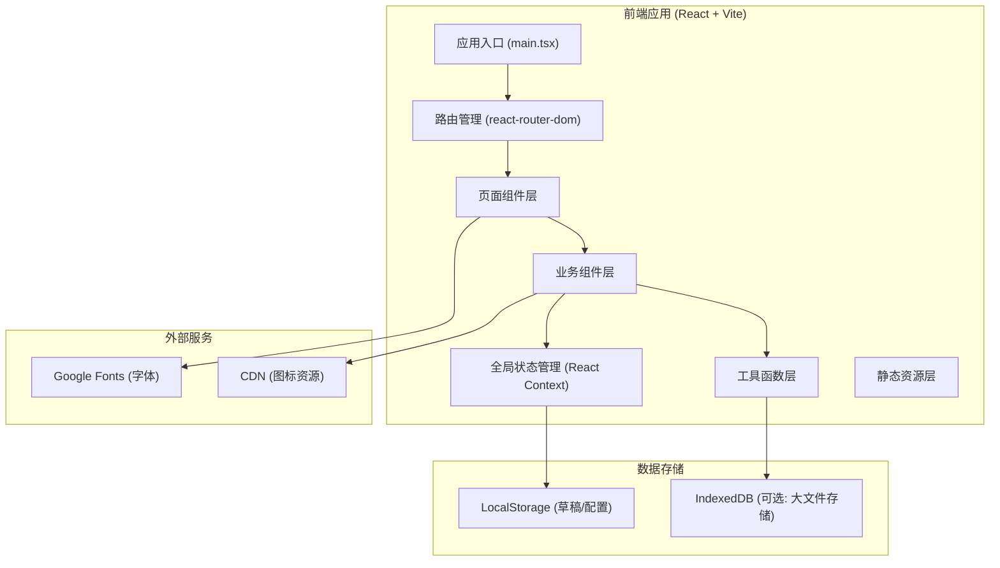

## 1. Architecture Design



## 2. Technology Description

- **前端框架**: React@18 + TypeScript@5
- **构建工具**: Vite@5
- **样式方案**: TailwindCSS@3 + CSS Variables
- **路由管理**: react-router-dom@6
- **状态管理**: React Context + useReducer (轻量级，无需 Redux)
- **拖拽功能**: @dnd-kit/core + @dnd-kit/sortable (高性能拖拽库)
- **图片导出**: html2canvas (DOM 转图片)
- **PDF 导出**: jspdf + html2canvas
- **图标库**: lucide-react (线性简约图标) + 自定义 SVG 图标素材
- **表单处理**: React Hook Form (轻量级表单验证)
- **颜色选择**: 原生 input type="color" + 自定义颜色面板
- **字体**: Google Fonts (Noto Serif SC, Noto Sans SC, Ma Shan Zheng)

## 3. Route Definitions

| Route | Purpose |
|-------|---------|
| `/` | 首页 - 模板选择 |
| `/editor/:templateId` | 标签编辑页面 |
| `/preview` | 预览和打印排版页面 |
| `/drafts` | 草稿管理页面 |
| `*` | 404 页面，重定向到首页 |

## 4. Data Model

### 4.1 核心数据类型定义

```typescript
// 标签模板类型
type TemplateType = 'circle' | 'square' | 'rectangle' | 'special';
type TemplateStyle = 'minimal' | 'vintage' | 'fresh' | 'luxury' | 'cute';

interface LabelTemplate {
  id: string;
  name: string;
  type: TemplateType;
  style: TemplateStyle;
  thumbnail: string;
  defaultWidth: number; // cm
  defaultHeight: number; // cm
  defaultElements: LabelElement[];
  defaultColors: ColorScheme;
}

// 标签元素类型
type ElementType = 'text' | 'icon' | 'image' | 'shape';

interface LabelElement {
  id: string;
  type: ElementType;
  x: number; // 相对位置百分比 0-100
  y: number;
  width: number;
  height: number;
  rotation: number;
  zIndex: number;
  locked: boolean;
  visible: boolean;
  
  // text 特有
  content?: string;
  fontSize?: number;
  fontFamily?: string;
  fontWeight?: number;
  fontStyle?: 'normal' | 'italic';
  textAlign?: 'left' | 'center' | 'right';
  color?: string;
  lineHeight?: number;
  
  // icon 特有
  iconName?: string;
  iconColor?: string;
  strokeWidth?: number;
  
  // shape 特有
  shapeType?: 'rect' | 'circle' | 'line';
  fillColor?: string;
  strokeColor?: string;
  strokeWidth?: number;
  borderRadius?: number;
  
  // image 特有
  imageSrc?: string;
  objectFit?: 'cover' | 'contain' | 'fill';
}

// 成分类
interface Ingredient {
  id: string;
  name: string;
  order: number;
  isAllergen: boolean;
  percentage?: string;
}

// 颜色方案
interface ColorScheme {
  primary: string;
  secondary: string;
  accent: string;
  background: string;
  text: string;
}

// 标签数据
interface LabelData {
  id: string;
  templateId: string;
  name: string; // 皂名
  weight: string; // 重量
  ingredients: Ingredient[];
  usage: string; // 使用方法
  shelfLife: string; // 保存期限
  batchNumber: string; // 批次编号
  allergyWarning: string; // 过敏提示
  width: number; // cm
  height: number; // cm
  elements: LabelElement[];
  colors: ColorScheme;
  createdAt: number;
  updatedAt: number;
}

// 打印设置
interface PrintSettings {
  paperSize: 'A4' | 'A5' | '6inch' | 'custom';
  paperWidth: number; // mm
  paperHeight: number; // mm
  labelsPerRow: number;
  labelsPerColumn: number;
  marginTop: number; // mm
  marginBottom: number;
  marginLeft: number;
  marginRight: number;
  gapX: number; // mm
  gapY: number;
  showCropMarks: boolean;
  copies: number;
}

// 草稿
interface Draft {
  id: string;
  name: string;
  thumbnail: string;
  labelData: LabelData;
  createdAt: number;
  updatedAt: number;
}
```

### 4.2 数据存储策略

- **草稿数据**: LocalStorage 存储，上限 5MB，自动保存（编辑后 2 秒防抖）
- **草稿缩略图**: 使用 html2canvas 生成 base64 图片，压缩存储
- **用户配置**: LocalStorage 存储默认纸张设置、常用颜色方案
- **临时数据**: React State 管理，不持久化

## 5. Core Module Architecture

### 5.1 目录结构

```
src/
├── main.tsx                 # 应用入口
├── App.tsx                  # 根组件
├── router/
│   └── index.tsx            # 路由配置
├── context/
│   ├── LabelContext.tsx     # 标签编辑状态
│   └── DraftContext.tsx     # 草稿管理状态
├── pages/
│   ├── HomePage.tsx         # 模板选择页
│   ├── EditorPage.tsx       # 标签编辑页
│   ├── PreviewPage.tsx      # 预览打印页
│   └── DraftsPage.tsx       # 草稿管理页
├── components/
│   ├── editor/              # 编辑器相关组件
│   │   ├── Canvas.tsx       # 画布组件
│   │   ├── CanvasElement.tsx # 可拖拽元素
│   │   ├── LeftPanel.tsx    # 左侧工具面板
│   │   ├── RightPanel.tsx   # 右侧属性面板
│   │   ├── FormSection.tsx  # 配方信息表单
│   │   ├── IngredientList.tsx # 成分列表
│   │   ├── ColorPicker.tsx  # 颜色选择器
│   │   └── IconLibrary.tsx  # 图标素材库
│   ├── template/            # 模板相关组件
│   │   ├── TemplateCard.tsx
│   │   ├── TemplateGrid.tsx
│   │   └── TemplateFilter.tsx
│   ├── preview/             # 预览相关组件
│   │   ├── PrintPreview.tsx
│   │   ├── LabelSheet.tsx
│   │   └── PrintSettingsPanel.tsx
│   ├── common/              # 通用组件
│   │   ├── Navbar.tsx
│   │   ├── Button.tsx
│   │   ├── Modal.tsx
│   │   ├── Toast.tsx
│   │   └── EmptyState.tsx
│   └── drafts/              # 草稿相关组件
│       ├── DraftCard.tsx
│       └── DraftGrid.tsx
├── hooks/
│   ├── useAutoSave.ts       # 自动保存 Hook
│   ├── useDebounce.ts
│   ├── useLocalStorage.ts
│   └── useDragAndDrop.ts
├── utils/
│   ├── export.ts            # 导出工具函数
│   ├── print.ts             # 打印工具函数
│   ├── templates.ts         # 模板预设数据
│   ├── icons.ts             # 图标素材数据
│   ├── colors.ts            # 颜色方案预设
│   └── units.ts             # 单位转换工具
├── types/
│   └── index.ts             # 类型定义
└── styles/
    └── index.css            # 全局样式和 Tailwind 配置
```

### 5.2 核心模块职责

| 模块 | 职责 | 关键技术 |
|------|------|----------|
| Canvas 画布 | 渲染标签元素、处理拖拽、缩放、选中 | @dnd-kit, CSS Transform |
| 元素编辑器 | 修改元素属性、文字编辑、样式调整 | React Context, 受控组件 |
| 成分管理 | 添加/删除/排序成分、过敏原标记 | @dnd-kit/sortable |
| 图标库 | SVG 图标素材、分类筛选、拖拽添加 | lucide-react, 自定义 SVG |
| 打印排版 | 纸张规格、自动排列、裁剪线 | CSS Grid, 打印媒体查询 |
| 图片导出 | DOM 转图片、质量控制、格式选择 | html2canvas |
| 草稿管理 | 本地存储、缩略图生成、自动保存 | LocalStorage, 防抖 |

## 6. Performance Optimization

- **画布渲染优化**: 使用 React.memo 包装 CanvasElement，避免不必要重渲染
- **拖拽性能**: 使用 @dnd-kit 的硬件加速拖拽，不触发重排
- **自动保存防抖**: 2 秒防抖，避免频繁写入 LocalStorage
- **图片懒加载**: 模板缩略图和草稿预览图懒加载
- **虚拟滚动**: 图标库和草稿列表过多时使用虚拟滚动
- **导出优化**: 导出前暂停动画，使用合适的 scale 参数控制图片质量

## 7. Key Technical Implementation Points

1. **拖拽系统**: 使用 @dnd-kit 实现画布内元素拖拽和成分列表排序
2. **厘米到像素转换**: 按屏幕 DPI 计算实际渲染尺寸，保证打印准确
3. **实时预览**: 编辑状态全局共享，预览页实时同步最新数据
4. **打印样式**: 使用 `@media print` 媒体查询，隐藏所有 UI 控件
5. **多标签管理**: Context 中支持多个标签数据的切换和管理
6. **撤销/重做**: 使用 useReducer 实现状态历史记录
7. **响应式画布**: 画布区域自适应容器大小，保持标签比例
